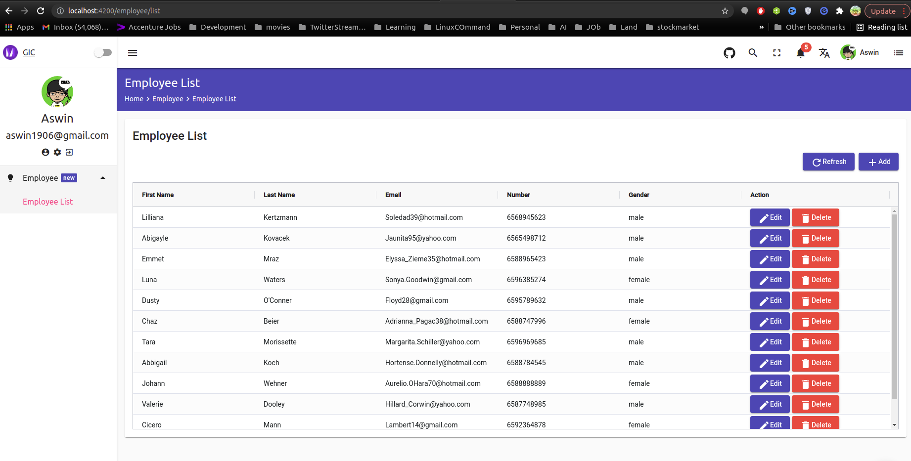
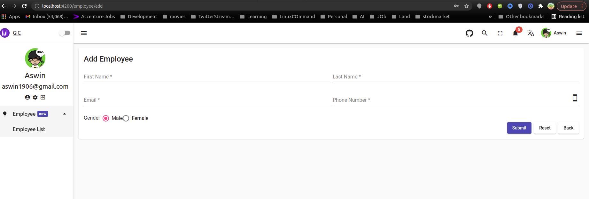
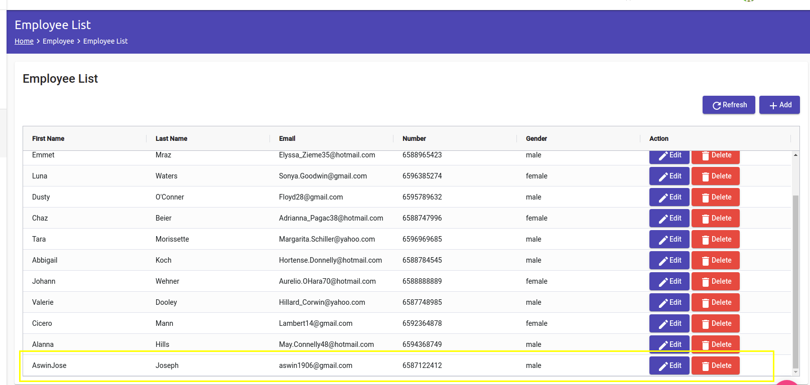
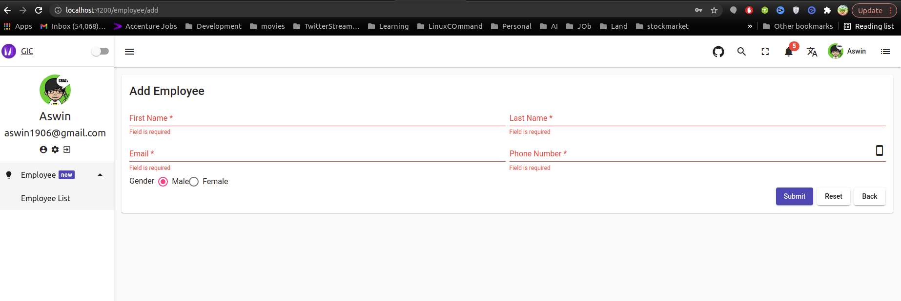
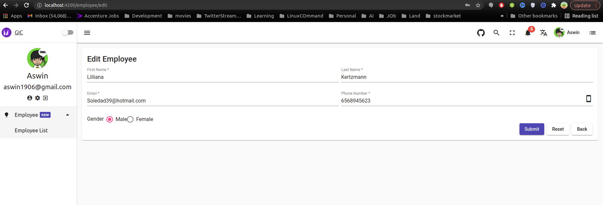
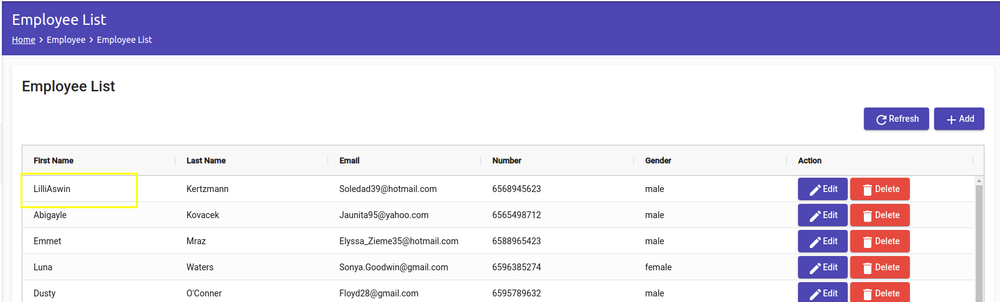
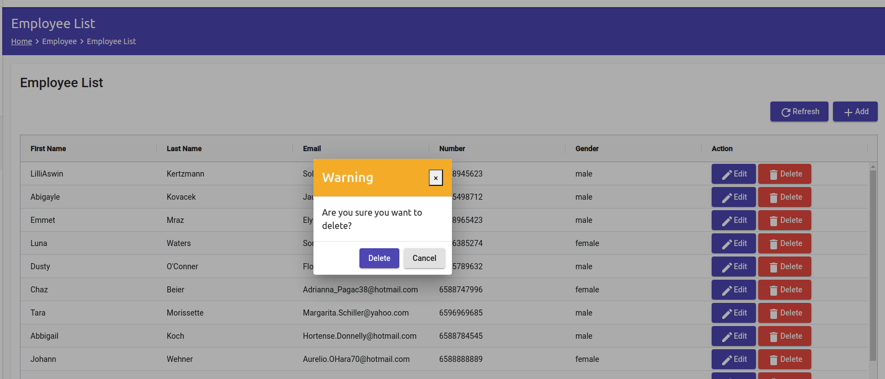

### Express Model View Controller Pattern (MVC)

The following is an illustration of how we can apply an **MVC** concept to our **NodeJS** application using the **Express Framework** by using GIC Task API's

#### Prerequisites:

- node v12.0.0
- angular v11.1.0
- Refer the module directory path at src/app/routes/employee

#### How to Run:

- install all modules first by typing `npm install` or `yarn add`

- to run it please type `npm run start`

#### Build Docker image:

```
  docker build -t gic-front-end:1.0 .
  docker run --rm -it --publish 4200:4200 gic-front-end:1.0 bash
```

## ✨ Features

Landing Page



Add New Employee


Newly Added Employee via LocalStorage


Form Validation


Edit Employee


Updated Employee


Delete Employee


## 📃 License

MIT
